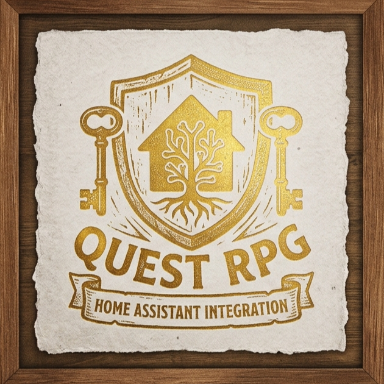

<p align="center">
  
</p>

# Quest RPG for Home Assistant

Turn household chores into an RPG-style quest board: a gold economy, a
reward shop, a fortune wheel, and voucher redemption - all as a proper
Home Assistant integration, installable via HACS and configured entirely
through the UI. No manual helpers, no template sensors, no hardcoded names.

## What you get

- **One config entry per player.** Add the integration once per person; each
  gets fully separate gold, quests, shop, and vouchers.
- **AI-generated quests**, via Home Assistant's own [AI Task](https://www.home-assistant.io/integrations/ai_task/)
  integration (introduced in HA 2025.7) - works with whatever AI Task entity
  you've configured (Google Generative AI, OpenAI, Anthropic, Ollama,
  OpenRouter, ...). Quest RPG doesn't talk to any AI provider directly and
  doesn't need its own API key.
- **A fortune wheel** with a configurable cost, prize table, and a daily
  *time window* during which it's spinnable.
- **A reward shop** with stock tracking, managed through its own card (add,
  edit price/stock, or remove items - no YAML editing).
- **A voucher system** so purchases can be redeemed later, with an
  admin/player distinction: players sell back at half price, admins can
  redeem in full or sell back at full price.
- **Five bundled Lovelace cards**, dark parchment/RPG themed, fully
  config-driven instead of hardcoded to one person's entities.

## Requirements

- Home Assistant **2025.7** or newer (for the AI Task integration).
- **An AI Task-capable integration, set up and selected per player.** There
  is no system-wide default this integration falls back to - each player
  must have an AI Task entity picked during setup (Google Generative AI,
  OpenAI, Anthropic Conversation, Ollama, OpenRouter, or any other
  integration that provides an AI Task entity). Without one selected, quest
  generation will fail; you can still add quests manually via the
  `quest_rpg.add_task` service, which falls back to a flat default reward
  with no AI-written flavour text.

## Installation

### Via HACS (recommended)

1. HACS → the "⋮" menu → **Custom repositories** → add
   `https://github.com/Xornop/ha-quest-rpg` as type **Integration**.
2. Install "Quest RPG", restart Home Assistant.
3. Settings → Devices & Services → **Add Integration** → search for
   "Quest RPG".

The dashboard cards are served by the integration automatically (registered
as a Lovelace resource on startup) - no separate frontend install step.

### Manually

Copy `custom_components/quest_rpg` into your Home Assistant `config/custom_components/`
folder and restart.

## Setting up a player

When you add the integration you'll be asked for:

| Field | Description |
|---|---|
| Player name | Anything - becomes the device/entity names, e.g. "Johnny" |
| AI Task entity | **Required.** Which AI Task entity generates this player's quests. |
| Quest language | Language quest text should be generated in (default: English) |
| Custom prompt | Add a custom prompt within the default prompt to adjust the task output. E.g. "use simple language a 4 year old would understand" |
| Wheel spin cost | Gold cost per spin (default: 10) |
| Max wheel spins per day | How many spins are allowed inside the window (default: 3) |
| Wheel available from / until | Daily time window the wheel can be spun in (default: 18:30-19:30) |

Add the integration again for a second player - names, options, and every
entity are fully independent per entry. All of this can be changed later
via the integration's **Configure** button.

### Entities created per player

Entity IDs are derived from the player name, prefixed with `quest_rpg_`.
For a player named "Johnny":

- `number.quest_rpg_johnny_gold`
- `number.quest_rpg_johnny_wheel_spins_today` - also carries `cost` /
  `max_spins` / `prizes` / `window_start` / `window_end` as attributes,
  read automatically by the wheel card
- `text.quest_rpg_johnny_new_task` - optional manual entry point for the AI
  quest generator (voice assistant, script, more-info dialog); the quests
  card's built-in input box calls the same logic directly and doesn't need
  this entity on your dashboard at all
- `todo.quest_rpg_johnny_quests`
- `todo.quest_rpg_johnny_shop_items` - manage through the shop-management
  card, or edit directly as `<emoji> <name> (₡price) (stock)`, e.g.
  `🍦 Ice cream trip (₡40) (2)`; blank/`(∞)` stock = unlimited
- `todo.quest_rpg_johnny_vouchers`
- `sensor.quest_rpg_johnny_quests` /
  `..._shop_items` / `..._vouchers` - what the cards
  read from

## Dashboard cards

Add these anywhere in your dashboard (`type: custom:...`):

| Card | Config |
|---|---|
| `quest-rpg-quests-card` | `gold_entity`, `quests_entity`, `hide_add_task?` |
| `quest-rpg-shop-card` | `gold_entity`, `shop_entity` |
| `quest-rpg-shop-admin-card` | `shop_entity`, `gold_entity` |
| `quest-rpg-vouchers-card` | `vouchers_entity`, `admin?` |
| `quest-rpg-wheel-card` | `gold_entity`, `spins_entity`, `cost?`, `prizes?`, `max_spins?` |

```yaml
type: custom:quest-rpg-quests-card
gold_entity: number.quest_rpg_johnny_gold
quests_entity: sensor.quest_rpg_johnny_quests

type: custom:quest-rpg-shop-card
gold_entity: number.quest_rpg_johnny_gold
shop_entity: sensor.quest_rpg_johnny_shop_items

type: custom:quest-rpg-shop-admin-card
shop_entity: sensor.quest_rpg_johnny_shop_items
gold_entity: number.quest_rpg_johnny_gold

type: custom:quest-rpg-vouchers-card
vouchers_entity: sensor.quest_rpg_johnny_vouchers
# admin: true   # shows "Redeem" + sells back at full price instead of half

type: custom:quest-rpg-wheel-card
gold_entity: number.quest_rpg_johnny_gold
spins_entity: number.quest_rpg_johnny_wheel_spins_today
# cost / prizes / max_spins are read automatically from the integration's
# options via the spins entity's attributes; only set these to override.
```

`entry_id` is resolved automatically from the entities' attributes - no
need to look it up yourself.

### Card gallery

| Card | Screenshot |
|---|---|
| **Quests** - active quest list, tap a quest to complete it and collect the gold reward. |  |
| **Shop** - reward shop, tap an item to buy it. |  |
| **Shop Management** *(admin)* - add, edit price/stock, or remove shop items. |  |
| **Vouchers** *(player view)* - sell purchased vouchers back for half price. |  |
| **Vouchers** *(admin view, `admin: true`)* - redeem vouchers, or sell back at full price. |  |
| **Wheel of Fortune** - daily spin within a configurable time window. |  |

### Admin-only cards

The **Shop Management** card and the **Vouchers** card with `admin: true`
set are meant for whoever manages the game (a parent, typically), not the
player. Home Assistant doesn't have a built-in "admin" concept for cards,
so restrict visibility yourself with the card's `visibility` option,
filtered to your own HA user:

```yaml
type: custom:quest-rpg-shop-admin-card
shop_entity: sensor.quest_rpg_johnny_shop_items
gold_entity: number.quest_rpg_johnny_gold
visibility:
  - condition: user
    users:
      - <your Home Assistant user id>

type: custom:quest-rpg-vouchers-card
vouchers_entity: sensor.quest_rpg_johnny_vouchers
admin: true
visibility:
  - condition: user
    users:
      - <your Home Assistant user id>
```

Put the player-facing `quest-rpg-vouchers-card` (without `admin: true`) on
the player's own view instead. You can find a user's ID under
**Settings → People → (user) → Advanced** (with Advanced Mode enabled on
your own profile).

## Tips

<details>
<summary>The full prompt:</summary>

```
INSTRUCTIONS_TEMPLATE = """You are a fairytale/RPG narrator. Rewrite the \
following everyday household task as a short, atmospheric RPG quest for an \
adventurer.

Rules for the quest text:
- One sentence at most.
- The concrete action must stay crystal clear - don't hide it behind vague \
metaphors.
- Vary the tone: sometimes a dangerous adventure, sometimes a royal duty, \
sometimes a friendly favour.
- Assign a fair gold reward between 1 and 100, based on how tedious or \
time-consuming the task is. If the task already mentions a point or gold \
amount, use that instead.
- Write the quest text in {language}.
- The reward MUST be the very last thing in the string, formatted exactly \
as "(₡N)" with N a whole number. Do not add a period, exclamation mark, or \
any other character after the closing parenthesis - it must be the last \
character of the string.

Rules for the deadline:
- Look for time references in the task (e.g. "before 10am", "today", \
"tomorrow at 2pm", "within 2 hours").
- Work out the exact target time based on the current time: {now}.
- If there is no specific time or deadline mentioned, leave the deadline \
empty.

Task: {task}"""

STRUCTURE = {
    "quest": {
        "selector": {"text": {}},
        "description": (
            "The rewritten quest text. It MUST end with the gold reward "
            "formatted exactly as (₡N), e.g. 'Slay the dust-dragon under "
            "the bed (₡15)' - the closing parenthesis must be the very "
            "last character, no trailing period or other punctuation."
        ),
        "required": True,
    },
    "due": {
        "selector": {"text": {}},
        "description": (
            "ISO 8601 datetime (YYYY-MM-DDTHH:MM:SS) for the deadline, or "
            "an empty string if the task has no deadline."
        ),
        "required": False,
    },
}
```
</details>details>

- When adding a task, you can add a time frame by simply typing it in natural
  language. E.g. "clean your room before tomorrow 8 am". The quest will be added
  with a timer. When the timer runs out, the value of the task drops to 1. The
  task can then still be completed in exchange for this minimum amount of coins.
- Add two cards to the dashboard: one task list with `hide_new_task: true` with the
  `visibility`  set only for the admin, and one task list without `hide_new_task:`
  with the `visibility` set for the player. That way, only the admin can add tasks.

## Services

This integration comes with the following new actions:

- `quest_rpg.add_task` - `config_entry_id`, `task_text` → AI-generate a quest and add to task list
- `quest_rpg.complete_quest` - `config_entry_id`, `quest_text` → pay out + remove quest
- `quest_rpg.spin_wheel` - `config_entry_id` → spin the wheel + pay out an amount of coins
- `quest_rpg.buy_item` - `config_entry_id`, `item_text` → buy an item + remove an amount of coins
- `quest_rpg.sell_voucher` - `config_entry_id`, `voucher_text`, `full_refund?` (default false → 50%, true → 100%)
- `quest_rpg.redeem_voucher` - `config_entry_id`, `voucher_text` (no refund - reward already handed over)
- `quest_rpg.add_gold` - `config_entry_id`, `amount` (can be negative)
- `quest_rpg.add_shop_item` - `config_entry_id`, `name`, `emoji?` (defaults to 🎫), `price`, `stock?` (blank = unlimited)
- `quest_rpg.remove_shop_item` - `config_entry_id`, `item_text` → delete an item from the shop
- `quest_rpg.update_shop_item` - `config_entry_id`, `item_text`, `price`, `stock?` → change the price and stock of a shop item

## License

MIT - see [LICENSE](LICENSE).
